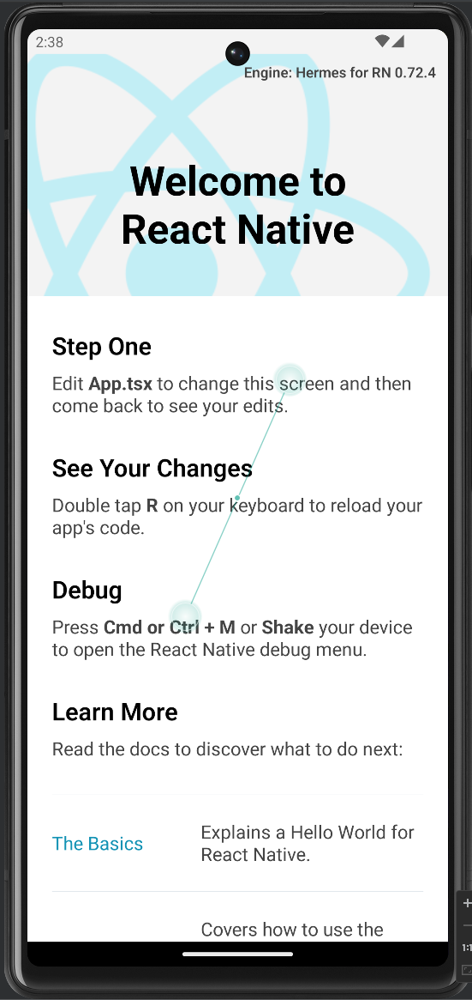

# react-native-tuya-link-error
Reproducible integration issue between react-native and tuya things sdk

## How to run
Run from the top level directory
```
yarn install
npx react-native start
```

Then open Android studio from the `./android` folder and run the app on a device or emulator. Run a Gradle build

The app should run and display the "Welcome to React Native" screen as shown below



In `android/app/build.gradle`, uncomment line 130 which includes the `security-algorithm-1.0.0.aar` file, run a Gradle build again and re-run the app.

This time the app will crash with the following error output in Logcat:

```
Process: com.reactnativetuyatest, PID: 20451
java.lang.UnsatisfiedLinkError: dlopen failed: cannot locate symbol "__emutls_get_address" referenced by "/data/app/~~47A-dR60cqtP9hCKbCgiCw==/com.reactnativetuyatest-Ofl7LYRdzcI-qdPytUsHCA==/base.apk!/lib/arm64-v8a/libfolly_runtime.so"...
at java.lang.Runtime.loadLibrary0(Runtime.java:1077)
at java.lang.Runtime.loadLibrary0(Runtime.java:998)
at java.lang.System.loadLibrary(System.java:1661)
at com.facebook.soloader.nativeloader.SystemDelegate.loadLibrary(SystemDelegate.java:24)
at com.facebook.soloader.nativeloader.NativeLoader.loadLibrary(NativeLoader.java:52)
at com.facebook.soloader.nativeloader.NativeLoader.loadLibrary(NativeLoader.java:30)
at com.facebook.soloader.SoLoader.loadLibrary(SoLoader.java:869)
```